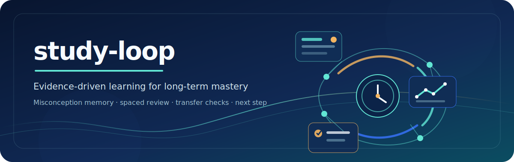

<div align="center">
  <p>
    
  </p>
  <p>
    <a href="https://github.com/monkeydyt/study-loop/actions/workflows/test.yml"></a>
    <a href="https://github.com/monkeydyt/study-loop/blob/main/LICENSE"></a>
    
    <a href="README_EN.md"></a>
  </p>
  <p>
    <a href="#快速开始">快速开始</a> ·
    <a href="docs/USAGE.md">使用手册</a> ·
    <a href="#它解决什么问题">核心能力</a> ·
    <a href="references/architecture.md">架构</a> ·
    <a href="CONTRIBUTING.md">参与贡献</a> ·
    <a href="README_EN.md">English</a>
  </p>
</div>

---

`study-loop` 是一个面向大学课程的本地优先、长期有状态的持续学习 Agent（Claude Code Skill）。它记录的不只是“答对没有”，还记录为什么会错、在什么条件下会错、能否迁移、依赖多少提示、多久会忘，以及下一步最值得学什么。

> **Explanation is not evidence.** 听懂不是掌握证据，独立完成才是。

## 快速开始

### 安装

需要 Python 3.11+。在 macOS/Linux 使用 `python3`，Windows 可将命令中的 `python3` 换成 `python`。

```bash
git clone https://github.com/monkeydyt/study-loop.git
cd study-loop
python3 -m pip install -r requirements.txt
python3 -m pytest
```

在 Claude Code 中将仓库放入 Skill 目录：

```bash
ln -s "$(pwd)" ~/.claude/skills/study-loop
```

Windows 用户可以直接复制仓库目录到 `%USERPROFILE%\.claude\skills\study-loop`，或使用 Git Bash/WSL 执行上面的软链接命令。

### 第一次使用

```bash
python3 scripts/init_course.py ~/courses/模拟电子技术 \
  --course-id analog-electronics \
  --name "模拟电子技术" \
  --exam-date 2026-07-25
```

然后进入课程目录，在 Claude Code 中说：

```text
/study
```

或者直接说：

```text
帮我复习模拟电子技术，先告诉我今天最值得做什么。
```

### 运行端到端 Demo

```bash
bash demo/demo.sh
```

Demo 会创建临时课程，演示注册知识点、答错、错因归因、修复、迁移重测、FSRS 和 next-best-step。不会修改你的真实课程目录。

## 它解决什么问题

传统学习助手通常只记录“做过什么”。`study-loop` 试图回答更有用的问题：

| 问题 | study-loop 的做法 |
|---|---|
| 我今天该学什么？ | 根据当前状态、考试日期、风险和到期卡推荐 next-best-step。 |
| 我为什么会错？ | 记录错误假设、缺失前提、错因类型和触发条件。 |
| 我是真的掌握了吗？ | 区分 explained、practiced、checked、confirmed、weak、blocked 等状态。 |
| 我会不会换个题型就又错？ | 通过 T0–T4 迁移阶梯和原题二刷验证。 |
| 过几天会不会忘？ | 使用 FSRS 对复习卡进行间隔调度。 |

## 核心能力

- **事件溯源**：学习行为写入 `events.jsonl`，状态由脚本派生，可按规则升级全量重建。
- **六态教学状态**：解释、练习、独立验证、迁移、薄弱点和前置阻塞分开建模。
- **错因记忆**：按 KC × 错因 × 触发条件长期记忆，修复要求原题二刷和迁移验证。
- **AI 出题四道闸门**：Generator → 盲解 Solver → 对抗 Reviewer → 机械验证。
- **一站式刷题**：`drill.py` 支持考纲直出和诊断先行，并输出 HTML、PDF 或 Markdown。
- **本地优先**：课程状态保存在本地工作区，`events.jsonl` 是事实来源，避免把学习状态交给不可见的模型记忆。

## 你可以直接这样说

| 想做什么 | 示例请求 |
|---|---|
| 开始学习 | `继续学习，告诉我今天最值得做的一件事。` |
| 按考纲刷题 | `按考纲给我出 10 道题，生成可点击的网页测验。` |
| 诊断弱点 | `先根据我的错题诊断薄弱知识点，再出 5 道题。` |
| 修复错题 | `带我分析这道题为什么错，并安排原题二刷和迁移验证。` |
| 查看状态 | `展示当前课程的掌握证据、错因和到期复习卡。` |

不确定从哪里开始时，直接说“帮我学习”；Agent 会先检查状态，再**先分流，再执行**。

## 工作方式

```text
用户请求
   ↓
SKILL.md 路由意图
   ↓
Python CLI 写入事件
   ↓
events.jsonl（唯一事实来源）
   ↓
派生状态 / FSRS / 错因记忆 / next-best-step
   ↓
Dashboard / HTML 测验 / PDF 试卷 / 对话建议
```

主 Agent 负责理解意图和解释结果；脚本负责确定性计算、状态升级、事件写入和题目验证。任何状态写入都应通过 `scripts/` 下的 CLI，不能直接编辑课程 `.study/` 文件。

## 多形态输出

```bash
# 按考纲直出 10 题，生成交互测验页
python3 scripts/drill.py --mode syllabus --count 10 --format html

# 按弱点自适应选 5 题，生成题目卷和答案解析卷
python3 scripts/drill.py --mode diagnostic --count 5 --format paper
```

网页测验支持运行时切换“点击显示解析”；PDF 输出带中文字体回退，可直接生成题目卷和答案解析卷。

## 仓库结构

```text
study-loop/
├── README.md                  # 中文项目首页
├── README_EN.md               # English project overview
├── SKILL.md                   # 主 Agent 路由与铁律
├── agents/                    # 出题三卡：Generator / Solver / Reviewer
├── references/                # 架构、证据、FSRS、迁移和错因规则
├── scripts/                   # CLI 入口与 studylib 核心库
├── templates/                 # Dashboard 与 HTML 测验模板
├── demo/                      # 端到端演示
├── tests/                     # pytest 测试
├── docs/                      # 使用手册和交付报告
├── assets/                    # README 视觉资产
└── .github/                   # CI、Issue 和 PR 模板
```

## 已实现与 Roadmap

### 已实现

- V1：事件溯源、六态教学状态、证据图谱、错因记忆、迁移验证、FSRS 和 `/study` 路由。
- V2：KC 中英对照、一站式 `drill`、HTML 交互测验、PDF 试卷和多形态输出。
- V3：README 顶部海报与导航优化、双语项目文档、Agent 新手引导协议，以及贡献、安全、Issue、PR 和 CI 协作入口。

### Roadmap

- 材料摄入管线：从课件/教材自动转文本并注册 KC。
- 完整自适应诊断：自评全图加抽测校准。
- HTML 作答回传：将网页作答结果导入 `attempt` 事件。
- 考后回传与跨课程学习指纹。

明确非目标：多用户、云同步和完整 GUI。

详细限制见 [`docs/DELIVERY-REPORT.md`](docs/DELIVERY-REPORT.md)。

## 测试

```bash
python3 -m pytest
git diff --check
```

GitHub Actions 会在 push 和 Pull Request 时自动运行测试。开发协作规则见 [`CONTRIBUTING.md`](CONTRIBUTING.md)。

## 文档入口

- [`docs/USAGE.md`](docs/USAGE.md)：面向学生的完整使用手册。
- [`SKILL.md`](SKILL.md)：主 Agent 的路由和铁律。
- [`references/architecture.md`](references/architecture.md)：事件源、派生状态和数据边界。
- [`docs/DELIVERY-REPORT.md`](docs/DELIVERY-REPORT.md)：交付报告、测试覆盖和已知限制。
- [`CHANGELOG.md`](CHANGELOG.md)：版本和变更记录。

## 参与贡献

欢迎提交文档改进、Bug 修复和可验证的新能力。开始前请阅读 [`CONTRIBUTING.md`](CONTRIBUTING.md)。安全问题请阅读 [`SECURITY.md`](SECURITY.md)，不要直接公开发布敏感信息。

## License

MIT，见 [`LICENSE`](LICENSE)。
