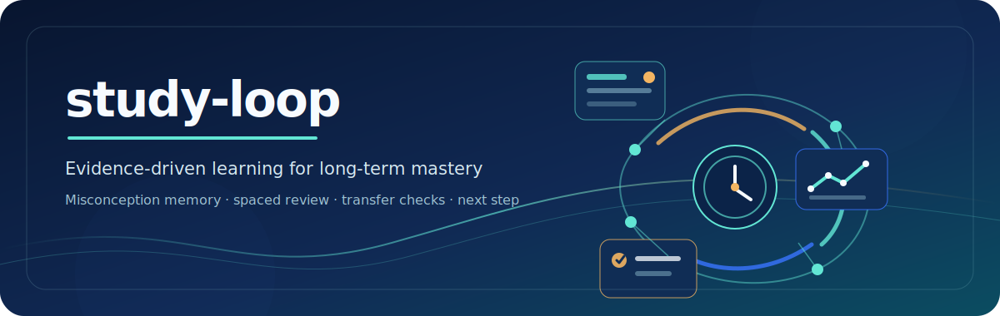

<div align="center">
  <p>
    
  </p>
  <p>
    <a href="https://github.com/monkeydyt/study-loop/actions/workflows/test.yml"></a>
    <a href="https://github.com/monkeydyt/study-loop/blob/main/LICENSE"></a>
    
    <a href="README.md"></a>
  </p>
  <p>
    <a href="#quick-start">Quick start</a> ·
    <a href="docs/USAGE.md">User guide</a> ·
    <a href="#what-it-solves">Core capabilities</a> ·
    <a href="references/architecture.md">Architecture</a> ·
    <a href="CONTRIBUTING.md">Contributing</a> ·
    <a href="README.md">中文</a>
  </p>
</div>

---

`study-loop` is a local-first, stateful learning agent for university courses. It tracks more than whether an answer was right: it records why you made a mistake, when the mistake appears, whether you can transfer the skill, how much help you needed, when you may forget it, and what to learn next.

> **Explanation is not evidence.** Understanding a solution is not the same as proving mastery.

## Quick start

### Install

Python 3.11+ is required. Use `python3` on macOS/Linux; on Windows, replace it with `python`.

```bash
git clone https://github.com/monkeydyt/study-loop.git
cd study-loop
python3 -m pip install -r requirements.txt
python3 -m pytest
```

For Claude Code, place the repository in the Skill directory:

```bash
ln -s "$(pwd)" ~/.claude/skills/study-loop
```

### Start a course

```bash
python3 scripts/init_course.py ~/courses/analog-electronics \
  --course-id analog-electronics \
  --name "Analog Electronics" \
  --exam-date 2026-07-25
```

Then enter the course directory and say `/study` in Claude Code, or ask:

```text
Help me study analog electronics. What is the most valuable next step?
```

### Run the end-to-end demo

```bash
bash demo/demo.sh
```

The demo creates a temporary course and walks through knowledge registration, a high-confidence mistake, misconception attribution, repair, transfer validation, FSRS, and next-best-step. It does not modify a real course.

## What it solves

| Question | How study-loop responds |
|---|---|
| What should I study today? | Recommends a next-best-step from state, exam date, risks, and due cards. |
| Why did I get it wrong? | Records wrong assumptions, missing premises, error types, and triggers. |
| Do I really know it? | Separates explained, practiced, checked, confirmed, weak, and blocked states. |
| Will I fail on a new variant? | Uses T0–T4 transfer levels plus an original-question retest. |
| When will I forget it? | Schedules review cards with FSRS. |

## Core capabilities

- **Event sourcing**: learning activity is appended to `events.jsonl`; state is derived and rebuildable.
- **Teaching states**: explanation, practice, independent checks, transfer, weakness, and prerequisite blocks are modeled separately.
- **Misconception memory**: mistakes are remembered by KC × error × trigger, then repaired through original and transfer retests.
- **Four AI question gates**: Generator → blind Solver → adversarial Reviewer → mechanical validation.
- **One-command drills**: `drill.py` supports syllabus-first and diagnostic-first selection, with HTML, PDF, or Markdown output.
- **Local-first data**: course state stays in the local workspace; `events.jsonl` is the source of truth.

## Example requests

| Goal | Example |
|---|---|
| Start studying | `Continue studying and tell me today's most valuable next step.` |
| Drill by syllabus | `Give me 10 syllabus questions as an interactive HTML quiz.` |
| Diagnose weaknesses | `Diagnose my weak knowledge points, then give me 5 questions.` |
| Repair a mistake | `Help me analyze this mistake and schedule an original retest plus a transfer test.` |
| Inspect progress | `Show my mastery evidence, misconceptions, and due review cards.` |

If you are unsure where to start, say “Help me study”; the agent checks your state first, then **route the intent before executing**.

## How it works

```text
User request
   ↓
SKILL.md routes the intent
   ↓
Python CLI appends an event
   ↓
events.jsonl (source of truth)
   ↓
Derived state / FSRS / misconception memory / next-best-step
   ↓
Dashboard / HTML quiz / PDF paper / conversational guidance
```

The agent handles intent and explanations. Scripts handle deterministic calculations, state transitions, event writes, and question validation. State must be written through the CLI under `scripts/`; do not edit course `.study/` files directly.

## Multiple output formats

```bash
python3 scripts/drill.py --mode syllabus --count 10 --format html
python3 scripts/drill.py --mode diagnostic --count 5 --format paper
```

HTML quizzes include a runtime explanation toggle. PDF output includes a Chinese-font fallback and can generate both question and answer-analysis papers.

## Repository map

```text
study-loop/
├── README.md                  # Chinese project homepage
├── README_EN.md               # English project overview
├── SKILL.md                   # Main agent routing and invariants
├── agents/                    # Generator / Solver / Reviewer cards
├── references/                # Architecture and learning rules
├── scripts/                   # CLI entry points and core library
├── templates/                 # Dashboard and HTML quiz templates
├── demo/                      # End-to-end demo
├── tests/                     # pytest suite
├── docs/                      # User guide and delivery report
├── assets/                    # README visual assets
└── .github/                   # CI, issue, and pull-request templates
```

## Delivered and roadmap

### Delivered

- V1: event sourcing, teaching states, evidence graph, misconception memory, transfer validation, FSRS, and `/study` routing.
- V2: bilingual KC labels, one-command drills, interactive HTML quizzes, PDF papers, and multiple output formats.
- V3: a redesigned README with a banner and navigation, bilingual project documentation, guided Agent onboarding, and contribution, security, issue, pull-request, and CI collaboration entry points.

### Roadmap

- Material ingestion from slides and textbooks.
- Full adaptive diagnosis with self-assessment calibration.
- Importing HTML quiz attempts as `attempt` events.
- Post-exam feedback and cross-course learning fingerprints.

Non-goals: multi-user collaboration, cloud sync, and a full GUI.

See [`docs/DELIVERY-REPORT.md`](docs/DELIVERY-REPORT.md) for current limitations.

## Tests

```bash
python3 -m pytest
git diff --check
```

GitHub Actions runs the test suite on pushes and pull requests. See [`CONTRIBUTING.md`](CONTRIBUTING.md) for development rules.

## Documentation

- [`docs/USAGE.md`](docs/USAGE.md): the complete student-facing guide.
- [`SKILL.md`](SKILL.md): main agent routing and invariants.
- [`references/architecture.md`](references/architecture.md): event source, derived state, and data boundaries.
- [`docs/DELIVERY-REPORT.md`](docs/DELIVERY-REPORT.md): delivery report, coverage, and limitations.
- [`CHANGELOG.md`](CHANGELOG.md): version and change history.

## Contributing

Documentation improvements, bug fixes, and verifiable new capabilities are welcome. Read [`CONTRIBUTING.md`](CONTRIBUTING.md) before starting. For security issues, read [`SECURITY.md`](SECURITY.md) and do not disclose sensitive information in a public issue.

## License

MIT. See [`LICENSE`](LICENSE).
